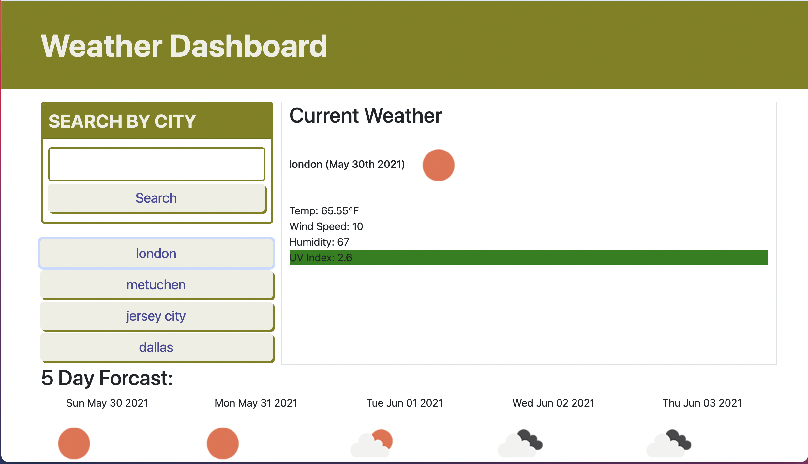

# Weather Dashboard

## Description
This application serves as an weather app that gives you the current weather and five day forecast. It even stores your searches so you can access them with a click of the button at a later time!

* [Technology](#technology)
* [Deployment](#deployment)
* [Usage](#usage)
* [Questions](#questions)
* [User Story](#user)
* [Acceptance Criteria](#acceptance)
* [License](#license)

## Technology

Created a weather dashboard utilizing bootstrap, jquery and ajax. With three api calls the website features the current weather and the five day forcast with local storage to save previous city searches.

## User Story:
AS A traveler  
I WANT to see the weather outlook for multiple cities  
SO THAT I can plan a trip accordingly  

## Acceptance Criteria:
GIVEN a weather dashboard with form inputs  
WHEN I search for a city  
THEN I am presented with current and future conditions for that city and that city is added to the search history  
WHEN I view current weather conditions for that city  
THEN I am presented with the city name, the date, an icon representation of weather conditions, the temperature, the humidity, the wind speed, and the UV index  
WHEN I view the UV index  
THEN I am presented with a color that indicates whether the conditions are favorable, moderate, or severe  
WHEN I view future weather conditions for that city  
THEN I am presented with a 5-day forecast that displays the date, an icon representation of weather conditions, the temperature, the wind speed, and the humidity  
WHEN I click on a city in the search history  
THEN I am again presented with current and future conditions for that city  

## Screenshot:

## Link to Deployed Application:
### https://stephgeorge22.github.io/weather-dashboard/
